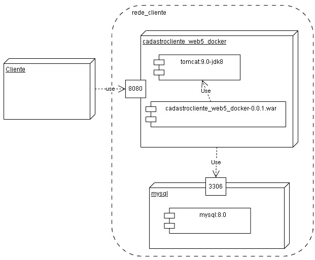

# Sistema de Cadastro de Clientes WEB com Docker Compose e MySQL

Sistema de Cadastro de Cliente WEB com Docker Compose e Banco de Dados MySQL em 3 camadas utilizando o padrão Abstract Factory.

## Sobre o projeto
 - O projeto foi desenvolvido no NetBeans deve ser chamado **cadastrocliente_web5_docker**.
 - Utiliza o **Java 8**.
 - Utiliza o **Apache Tomcat 9** como servidor de aplicações Web.
 - Utiliza o **Apache Maven** para automatizar o processo de construção da aplicação.
 - A aplicação é empacotada no formato **WAR (Web Application Archive)**.
 - Utiliza o **Docker** para criar e executar os containers da aplicação e do banco de dados.
 - Utiliza o **Docker Compose** para definir e gerenciar os serviços da aplicação. 
 - Utiliza o **MySQL 8.4** como banco de dados da aplicação. 
 - O projeto é um **CRUD** para os dados de cliente (clienteId, nome, cpf).
 - As classes do projeto está organizado nos **pacotes** visão, controle, modelo, dao além de um pacote util.
 - Utiliza o padrão **abstract factory** para abstrair 3 formas de armazenamento:
	- 1 - Banco de Dados(MySQL)
	- 2 - HashMap
	- 3 - Arquivo Binário
 - Toda iteração com banco de dados é tratada diretamente pelo **DAO**(Data Access Object).
 - Se desejar utilizar outra **fonte de dados**, edite o arquivo src\dao\Factory.java alterando a FABRICA para outro valor.
 - Os dados de **configuração** (Servidor, Database, Usuario, Senha) da integração do java com o banco de dados estão no arquivo src/dao/DadosBanco.java.<br>
 - A especificação da **fábrica** a ser utilizada é feita na interface Factory.java. 
 - A **interface gráfica** foi construída utilizando HTML, JavaScript e CSS.

## Banco de dados

- O banco de dados e a tabela são criados no primeiro acesso ao banco de dados MySQL.

### Cria a tabela de tb_alunos

- Abaixo o script SQl se precisar criar o banco de dados e a tabela[banco.sql](banco.sql).

```
# Criar o database chamado db_cliente
create database if not exists db_cliente;

# Entrar no database db_cliente
use db_cliente;

# Remover a tabela para recriá-la
drop table if exists cliente;

# Criar a tabela de tb_alunos
create table cliente (clienteid integer, 
                      nome      varchar(100), 
                      cpf       varchar(11), 
                      constraint pk_cliente primary key (clienteid));

```

## Docker
 - Utilizar o terminal do Windows Powershel em modo administrador.

### Para criar os conteiner e os serviços
 - ```docker compose up --build```

### Parar os serviços
 - ```docker compose down -v```

### Abra o navegador em:
 - http://localhost:8080/

### Remover as imagens
 - ```docker compose down --rmi all```

## Arquivos

- banco.sql - Script do banco de dados.
- pom.xml - Arquivo de configuração da ferramenta de automação Maven.
- Dockerfile - Arquivo de configuração do Docker.
- compose.yml - Arquivo de configuração da composição do Docker.

## Arquitetura Sistema


